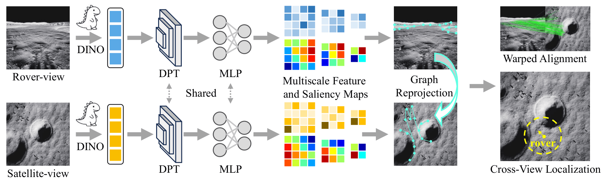

# 🌙 Globally Localizing Lunar Rover in Pixels via Graph Alignment

<div align="center">    <p><em>Official implementation of "Globally Localizing Lunar Rover in Pixels via Graph Alignment"</em></p></div>

------


## 📸 Framework Overview

<div align="center">    <br>  <em>The proposed graph alignment framework for high-precision lunar rover localization.</em></div>

------


## 🛠️ 1. Environment Setup

Our experiments are conducted using **Python 3.9** and **PyTorch 2.0.1**. Follow the steps below to prepare your environment:

1. **Install PyTorch:** Follow the [official instructions](https://www.google.com/url?sa=E&q=https%3A%2F%2Fpytorch.org%2Fget-started%2Fprevious-versions%2F) to install PyTorch (matching your CUDA version).

2. **Install Dependencies:**

   ```
   pip install -r requirements.txt
   ```

3. **DINOv3 Integration:**

   - Clone the [DINOv3 repository](https://www.google.com/url?sa=E&q=https%3A%2F%2Fgithub.com%2Ffacebookresearch%2Fdinov3) and update the repository path in `./models/DINOv3/dinov3_encoder.py` to point to your local repository.
   - Update the pretrained weight paths in `./models/DINOv3/dinov3_encoder.py` to point to your local files.

------


## 📂 2. Data Preparation

We evaluate our method on three benchmark datasets: **LuSNAR**, **South**, and **YuTu-2**.

### 🌑 LuSNAR Dataset

1. **Download:** Access the dataset [here](https://www.google.com/url?sa=E&q=https%3A%2F%2Fgithub.com%2Fzqyu9%2FLuSNAR-dataset%2F).
2. **Organization:** Place the left camera images, depth maps, and satellite (BEV) images as follows:

```
data/
└── LuSNAR/
    └── raw_data/
        ├── Moon_1/
        │   ├── left_images/  # First scene: Left camera images (.png)
        │   ├── sat_images/   # First scene: Satellite BEV images (.png)
        │   └── depths/       # First scene: Depth maps (.pfm)
        ├── Moon_2/
        │   ├── ...
        └── ...
```

3. **Processing:** Run the following command to generate the processed `.pth` files:

```
cd data/LuSNAR
python process_data.py
```

### 🛰️ South Dataset

The South dataset is available **upon request**.

- Please send an email to [chenmao2024@ia.ac.cn](https://www.google.com/url?sa=E&q=mailto%3Achenmao2024%40ia.ac.cn).
- Please include a brief description of your research purpose.

### 🚜 YuTu-2 Dataset

We regret to inform you that the YuTu-2 dataset is currently restricted and cannot be made public at this time.

------


## 🚀 3. Training & Evaluation

To train the model and evaluate its performance, run the main training script. This process will execute both the training phase and the subsequent testing.

### 🏃 Run Training

```
python train.py
```

### ⚙️ Configuration

You can customize the hyperparameters, dataset, and model settings by modifying the configuration files located in:
`./configs/warg_configs/`

------


<div align="center">  <sub>For any questions, please open an issue or contact the authors.</sub></div>